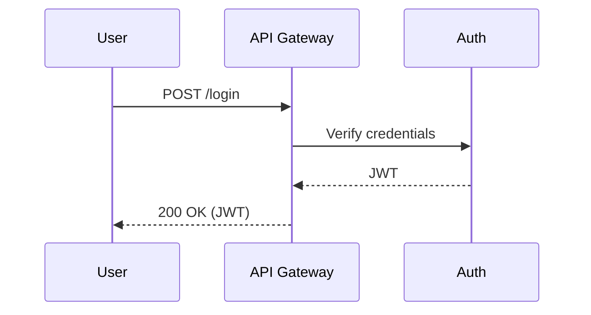

# Mermaid Agent Documenter

An intelligent CLI tool that uses AI agents to generate comprehensive Mermaid diagrams and documentation from application transcripts, walkthroughs, and recordings.

## ✨ Features

- 🤖 **AI-Powered Analysis** - Uses advanced LLMs to understand application workflows from transcripts
- 📊 **Multiple Diagram Types** - Generates sequence, flowchart, class, ER, state, and journey diagrams
- 🔧 **Multi-Provider Support** - Works with OpenAI, Anthropic Claude, and Google Gemini
- 🛡️ **Safe & Configurable** - Built-in safety controls, confidence thresholds, and PII redaction
- 📁 **Structured Output** - Produces organized Markdown files with embedded Mermaid diagrams
- ⚡ **CLI-First Design** - Simple command-line interface with dry-run capabilities
- 🔄 **Tool Integration** - Extensible tool system for file operations and web fetching

## 📋 Requirements

- **Go 1.24+** - Required for building and running
- **API Key** - One of the following:
  - `OPENAI_API_KEY` for GPT models
  - `ANTHROPIC_API_KEY` for Claude models
  - `GOOGLE_API_KEY` for Gemini models

## 🚀 Installation

### Option 1: Download Pre-built Binary
```bash
# Download from GitHub releases (coming soon)
# curl -L https://github.com/landanqrew/mermaid-agent-documenter/releases/download/v1.0.0/mad-linux-amd64 -o mad
# chmod +x mad
```

### Option 2: Build from Source
```bash
# Clone the repository
git clone https://github.com/landanqrew/mermaid-agent-documenter.git
cd mermaid-agent-documenter

# Build the CLI tool
go build -o mad .

# (Optional) Move to PATH
sudo mv mad /usr/local/bin/
```

## ⚙️ Setup and Configuration

### 1. Initialize the Tool
```bash
# Create configuration and directories
./mad init
```

This creates:
- `~/mermaid-agent-documenter/config.json` - Configuration file
- `~/mermaid-agent-documenter/output/` - Generated documentation
- `~/mermaid-agent-documenter/logs/` - Execution logs

### 2. Set API Key
Choose one provider and set the corresponding environment variable:

```bash
# For OpenAI (default)
export OPENAI_API_KEY="your-openai-api-key-here"

# For Anthropic Claude
export ANTHROPIC_API_KEY="your-anthropic-api-key-here"

# For Google Gemini
export GOOGLE_API_KEY="your-google-api-key-here"
```

### 3. Configure Provider (Optional)
Edit `~/mermaid-agent-documenter/config.json` to change:
- Default provider (`"provider": "openai"`)
- Model selection per provider
- Safety settings
- Confidence thresholds

## 📖 Usage

### Basic Workflow

1. **Prepare your transcript** - Create a text file with your application walkthrough/recording
2. **Run the agent** - Use the CLI to analyze and generate documentation
3. **Review output** - Check the generated Markdown files with Mermaid diagrams

### Example Transcript File
Create a file called `my-app-transcript.txt`:

```
This is a walkthrough of our user authentication system.

When a user logs in, they provide their username and password to the login form.
The frontend sends a POST request to /api/login with the credentials.
The API gateway receives this request and forwards it to the authentication service.

The authentication service validates the credentials against the user database.
If the credentials are valid, it generates a JWT token and returns it.
The API gateway then sends the JWT back to the frontend, and the user is logged in.
```

### Generate Documentation
```bash
# Dry run (safe - shows what would be done without executing)
./mad run my-app-transcript.txt --dry-run

# Generate documentation (with confirmation prompt)
./mad run my-app-transcript.txt

# Skip confirmation
./mad run my-app-transcript.txt --yes
```

## 📋 Command Reference

### `mad init`
Initialize the working directory and create default configuration.

```bash
./mad init
```

### `mad run [transcript]`
Run the agent on a transcript to generate documentation.

```bash
./mad run transcript.txt [flags]

Flags:
  --dry-run   Print planned actions without executing
  --yes       Skip confirmation prompts
```

### `mad plan [transcript]`
Plan the agent's actions without executing (shows what would be generated).

```bash
./mad plan transcript.txt [flags]

Flags:
  --yes       Skip confirmation prompts
```

### `mad validate [path]`
Validate a generated manifest or Mermaid file for syntax correctness.

```bash
./mad validate docs/diagrams/auth/sequence-login.md
```

### `mad config`
Manage configuration settings.

```bash
./mad config  # Shows current configuration
```

## 📁 Output Structure

Generated files are organized in `~/mermaid-agent-documenter/output/docs/diagrams/`:

```
output/
├── docs/
│   └── diagrams/
│       ├── auth/
│       │   ├── sequence-login.md
│       │   └── flowchart-auth.md
│       ├── user/
│       │   └── class-user-model.md
│       └── api/
│           └── sequence-api-flow.md
```

### Example Generated File
```markdown
---
title: User Login and Token Issuance
area: auth
tags: [sequence, auth]
---

## Context
Sequence covering credential verification and JWT issuance via API Gateway and Auth service.


```

## 🔧 Configuration Options

The `config.json` file supports the following settings:

```json
{
  "provider": "openai",           // Default LLM provider
  "models": {                     // Model selection per provider
    "openai": "gpt-5-mini",
    "anthropic": "claude-3.5-sonnet",
    "google": "gemini-2.5-flash"
  },
  "log": {
    "level": "info",              // Logging level
    "redact": true,               // Redact sensitive data
    "storeChainOfThought": false  // Store AI reasoning (optional)
  },
  "safety": {
    "mode": "standard",           // Safety mode: strict|standard|off
    "piiRedaction": true          // Auto-redact PII
  },
  "limits": {
    "maxSteps": 12,               // Max agent steps per run
    "runTimeoutSec": 300,         // Timeout in seconds
    "tokenBudget": 100000,        // Max tokens per run
    "costCeilingUsd": 1.0         // Max cost per run
  },
  "confidenceThreshold": 0.90,    // Min confidence for file writes
  "outDir": "~/mermaid-agent-documenter/output"
}
```

## 🎯 Supported Diagram Types

The agent automatically selects the most appropriate diagram type:

- **Sequence Diagrams** - For request/response flows, API calls, authentication
- **Flowcharts** - For business logic, decision trees, error handling
- **Class Diagrams** - For data models, object relationships
- **ER Diagrams** - For database schemas and relationships
- **State Diagrams** - For lifecycle management, state transitions
- **Journey Diagrams** - For user journeys and workflows
- **Graph Diagrams** - For deployment topology and connectivity

## 🚨 Troubleshooting

### Common Issues

**"API key not found"**
```bash
# Check if environment variable is set
echo $OPENAI_API_KEY

# Set the API key
export OPENAI_API_KEY="your-key-here"
```

**"Command not found"**
```bash
# Make sure the binary is executable and in PATH
chmod +x ./mad
./mad --help

# Or move to PATH
sudo cp mad /usr/local/bin/mad
```

**"Build fails"**
```bash
# Ensure Go 1.24+ is installed
go version

# Clean and rebuild
go clean
go mod tidy
go build -o mad .
```

**"Agent execution failed"**
- Check your API key is valid and has sufficient credits
- Try with a smaller transcript file first
- Use `--dry-run` to test without API calls
- Check the logs in `~/mermaid-agent-documenter/logs/`

### Getting Help
```bash
# Show all commands
./mad --help

# Show command-specific help
./mad run --help
./mad init --help
```

## 📊 Examples

### Simple Authentication Flow
**Input Transcript:**
```
Users log in by entering username/password. The app sends credentials to /auth endpoint, which validates against the database and returns a JWT token.
```

**Generated Output:**
- `docs/diagrams/auth/sequence-login.md` - Login sequence diagram
- `docs/diagrams/auth/flowchart-auth-validation.md` - Authentication validation flow

### Complex E-commerce Checkout
**Input Transcript:**
```
Checkout process starts when user clicks 'Buy Now'. Cart items are validated, payment is processed via Stripe, order is created in database, confirmation email is sent.
```

**Generated Output:**
- `docs/diagrams/checkout/sequence-checkout-flow.md` - Complete checkout sequence
- `docs/diagrams/payment/flowchart-payment-processing.md` - Payment validation logic
- `docs/diagrams/order/state-order-lifecycle.md` - Order state transitions

## 🤝 Contributing

1. Fork the repository
2. Create a feature branch
3. Make your changes
4. Add tests for new functionality
5. Submit a pull request

## 📄 License

This project is licensed under the MIT License - see the LICENSE file for details.

## 🙏 Acknowledgments

- Built with [Cobra CLI](https://cobra.dev/) for the command-line interface
- Uses [Google GenAI](https://ai.google.dev/) for Gemini integration
- Mermaid diagram syntax validation and rendering
