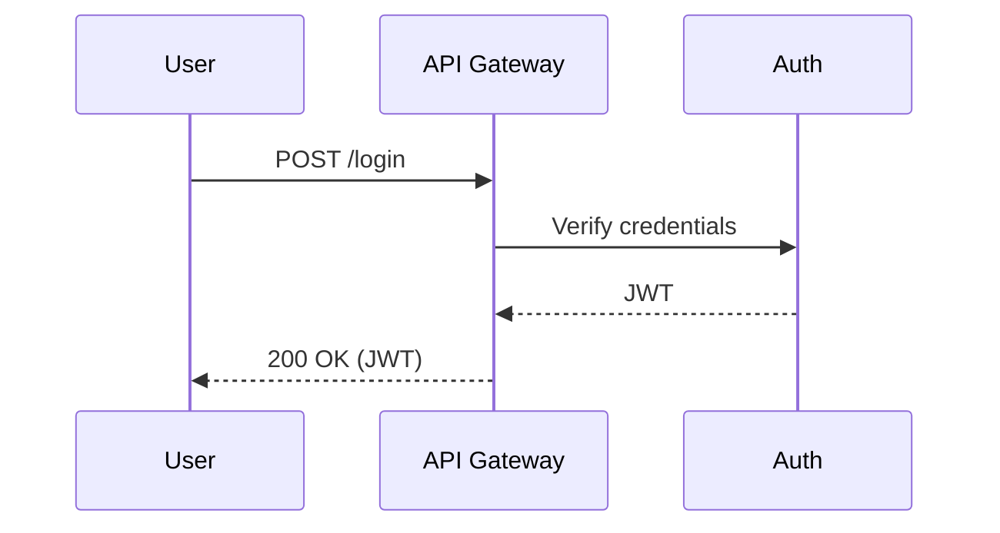

# Mermaid Agent Documenter

An intelligent CLI tool that uses AI agents to generate comprehensive Mermaid diagrams and documentation from application transcripts, walkthroughs, and recordings.

## ✨ Features

- 🤖 **AI Agent System** - Advanced LLM-powered agents that perform multi-step analysis with tool calling
- 📊 **Multiple Diagram Types** - Generates sequence, flowchart, class, ER, state, journey, and graph diagrams
- 🖼️ **Image Generation** - Automatically converts Mermaid diagrams to SVG/PNG/PDF using Mermaid CLI
- 🔧 **Multi-Provider Support** - Works with OpenAI, Anthropic Claude, and Google Gemini
- 🛡️ **Enterprise-Grade Safety** - Confidence thresholds, structured output validation, PII redaction
- 📁 **Project-Based Organization** - Dedicated directories for transcripts, outputs, and logs per project
- ⚡ **Live Model Discovery** - Queries provider APIs for current model availability
- 🔄 **Extensible Tool System** - Modular tools for file operations, web fetching, image generation, and user interaction
- 📝 **Structured Output** - JSON-based agent responses with confidence scoring and action planning

## 📋 Requirements

- **Go 1.24+** - Required for building and running
- **Node.js & npm** - Required for Mermaid CLI image generation
- **API Key** - One of the following:
  - `OPENAI_API_KEY` for GPT models
  - `ANTHROPIC_API_KEY` for Claude models
  - `GOOGLE_API_KEY` for Gemini models

### Optional Dependencies

- **Mermaid CLI** - For automatic SVG/PNG/PDF generation:
  ```bash
  npm install -g @mermaid-js/mermaid-cli
  ```

## 🚀 Installation

### Option 1: Go Install (must have go installed. visit https://webinstall.dev/golang/ if not)
```bash
go install github.com/landanqrew/mermaid-agent-documenter@latest
```
> PLEASE NOTE: OPTION ONE WILL MEAN THE BASE COMMAND IS `mermaid-agent-documenter` RATHER THAN `mad`

### Option 2: Build from Source
```bash
# Clone the repository
git clone https://github.com/landanqrew/mermaid-agent-documenter.git
cd mermaid-agent-documenter

# Build the CLI tool
go build -o mad .

# (Optional) Move to PATH
sudo mv mad $PATH
```

## ⚙️ Setup and Configuration

### 1. Initialize the Global Environment
```bash
# Initialize global configuration
mad init
```

This creates:
- `~/mermaid-agent-documenter/config.json` - Global configuration file
- `~/mermaid-agent-documenter/logs/` - Global execution logs

### 2. Create a Project
```bash
# Create a new project in the current directory
mad init my-project

# Or create a project for an e-commerce application
mad init ecommerce-app
```

This creates:
- `my-project/` - Project directory
- `my-project/config.json` - Project reference in global config
- `my-project/transcripts/` - Place your transcript files here
- `my-project/out/` - Generated diagrams and documentation
- `my-project/logs/` - Project-specific execution logs

### 3. Set API Key
Choose one provider and set the corresponding environment variable:

```bash
# For OpenAI (default)
export OPENAI_API_KEY="your-openai-api-key-here"

# For Anthropic Claude
export ANTHROPIC_API_KEY="your-anthropic-api-key-here"

# For Google Gemini
export GOOGLE_API_KEY="your-google-api-key-here"
```

### 4. Configure Provider (Optional)
Edit `~/mermaid-agent-documenter/config.json` to change:
- Default provider (`"provider": "openai"`)
- Model selection per provider
- Safety settings
- Confidence thresholds

## 🤖 Agent System

The core of Mermaid Agent Documenter is its sophisticated agent system that uses advanced LLMs to analyze transcripts and generate documentation through structured tool calling.

### Agent Capabilities

- **Multi-Step Analysis** - Agents can perform multiple tool calls in sequence
- **Confidence Scoring** - Each action includes confidence levels (90% threshold for file writes)
- **Structured Output** - JSON-based responses for tool calls, final manifests, or clarification requests
- **Safety Controls** - PII redaction, content filtering, and execution limits
- **Tool Integration** - Access to filesystem, web content, and user interaction tools

### Available Agent Tools

- **File System Tools** - Read/write files, list directories, create directories
- **Web Tools** - Fetch Mermaid documentation and external resources
- **User Interaction** - Get clarification or additional input when needed
- **Logging Tools** - Track agent activities and execution history

### Agent Workflow

1. **Analysis Phase** - Agent reads and analyzes the transcript
2. **Planning Phase** - Agent determines appropriate diagram types and structure
3. **Generation Phase** - Agent calls tools to create organized output files
4. **Validation Phase** - Agent validates generated content meets quality standards

## 📖 Usage

### Basic Workflow

1. **Create a project** - Initialize a project for your application
2. **Add transcripts** - Place your application walkthrough files in the project's `transcripts/` directory
3. **Run the agent** - Use the CLI to analyze transcripts and generate documentation
4. **Review output** - Check the generated Markdown files with Mermaid diagrams in the `out/` directory

### Example Workflow

```bash
# 1. Create a project
mad init my-auth-app

# 2. Add your transcript file
echo "This is a walkthrough of our user authentication system..." > my-auth-app/transcripts/auth-walkthrough.txt

# 3. Generate documentation
cd my-auth-app
.mad run auth-walkthrough.txt --dry-run  # Preview what will be generated

# 4. Generate the actual documentation
.mad run auth-walkthrough.txt

# 5. Check the output
ls out/docs/diagrams/
```

### Example Transcript File
Create `my-auth-app/transcripts/auth-walkthrough.txt`:

```
This is a walkthrough of our user authentication system.

When a user logs in, they provide their username and password to the login form.
The frontend sends a POST request to /api/login with the credentials.
The API gateway receives this request and forwards it to the authentication service.

The authentication service validates the credentials against the user database.
If the credentials are valid, it generates a JWT token and returns it.
The API gateway then sends the JWT back to the frontend, and the user is logged in.
```

### Generate Documentation
```bash
# From within your project directory
mad run auth-walkthrough.txt --dry-run   # Preview generation
mad run auth-walkthrough.txt             # Generate with confirmation
mad run auth-walkthrough.txt            # Interactive: choose documentation types
```

## 📋 Command Reference

### `mad init [project-name]`
Initialize a new project or the global environment.

```bash
mad init                    # Initialize global environment
mad init my-project         # Create new project called "my-project"
```

### `mad run [transcript]`
Run the agent on a transcript to generate documentation.

```bash
mad run transcript.txt [flags]

Flags:
  --dry-run   Print planned actions without executing

Interactive Features:
- Prompts for documentation type preferences before execution
- Shows numbered list of available documentation types
- Allows selection of specific types or automatic detection

Notes:
- If run from within a project directory, uses project's transcripts/ and out/ directories
- If no current project is set, uses global configuration
- Agent execution is automatic (no confirmation prompt needed)
```

### `mad plan [transcript]`
Plan the agent's actions without executing (shows what would be generated).

```bash
mad plan transcript.txt [flags]

Flags:
  --dry-run   Preview what the agent would generate (no execution)
```

### `mad validate [path]`
Validate a generated manifest or Mermaid file for syntax correctness.

```bash
mad validate docs/diagrams/auth/sequence-login.md
```

### `mad config secrets set <provider> <api-key>`
Set API key for a model provider.

```bash
mad config secrets set openai "sk-your-openai-key-here"
mad config secrets set anthropic "sk-ant-your-anthropic-key"
mad config secrets set google "your-google-api-key"
```

### `mad config secrets list`
List configured API keys (without showing actual keys).

```bash
mad config secrets list
```

### `mad config provider set <provider>`
Set the default LLM provider.

```bash
mad config provider set openai      # Use OpenAI models
mad config provider set anthropic   # Use Anthropic models
mad config provider set google      # Use Google models
```

### `mad config provider list`
List available providers and current selection.

```bash
mad config provider list
```

### `mad config model set <model>`
Set the model for the current provider.

```bash
# For OpenAI
mad config model set gpt-4o
mad config model set gpt-4o-mini

# For Anthropic
mad config model set claude-3-5-sonnet-20241022
mad config model set claude-3-haiku-20240307

# For Google
mad config model set gemini-1.5-pro
mad config model set gemini-1.5-flash

# You can also use any custom model name
mad config model set my-custom-model
```

**Note**: You can use any model name that the provider supports. The system will attempt to use it even if it's not in our known models list.

### `mad config model list`
List available models for the current provider.

```bash
mad config model list
```

Shows both "known" models (from our curated list) and "custom" models you've configured.

### `mad config model refresh`
Query provider APIs for current model availability.

```bash
mad config model refresh
```

**Features**:
- Connects to provider APIs to get live model lists
- Falls back to known models if API is unavailable
- Shows new models not in our curated list
- Displays model status (known, custom, new)
- No API key required (uses known models as fallback)

**Example Output**:
```
🔄 Refreshing models for Openai...
📡 Fetching from provider API...
✅ Found 15 models from API:

📋 Known Models (available via API):
✅ gpt-4o (current)
○ gpt-4o-mini
○ gpt-4-turbo

🆕 New/Discovered Models:
○ gpt-4o-new-variant
○ gpt-4-turbo-new

💡 Tip: You can use these new models with:
   mad config model set <model-name>
```

### `generateMermaidImage` (Agent Tool)
Generate SVG/PNG/PDF images from Mermaid diagram files using Mermaid CLI.

**Parameters**:
- `inputFile`: Path to Markdown file containing Mermaid diagrams
- `outputFile`: Path for output image file (without extension)
- `format`: Output format - "svg", "png", or "pdf" (default: "svg")
- `createDirs`: Create output directories if they don't exist (default: true)

**Example Usage** (called by agent):
```json
{
  "type": "tool_call",
  "tool": "generateMermaidImage",
  "args": {
    "inputFile": "docs/diagrams/auth/login_flow.md",
    "outputFile": "docs/diagrams/auth/login_flow",
    "format": "svg"
  }
}
```

**Requirements**: Install Mermaid CLI first:
```bash
npm install -g @mermaid-js/mermaid-cli
```

**Troubleshooting**:
- **"Mermaid CLI (mmdc) is not installed"**: Install with `npm install -g @mermaid-js/mermaid-cli`
- **"No diagram found"**: Ensure input file contains valid Mermaid code blocks
- **"Syntax error"**: Check Mermaid diagram syntax in input file
- **Permission issues**: Ensure write permissions for output directory

### `mad config project set <project-directory>`
Set the current project directory.

```bash
mad config project set /path/to/my-project
mad config project set ./my-auth-app
```

## 📁 Output Structure

### Project-Based Organization
When using projects, generated files are organized in your project's `out/` directory:

```
my-project/
├── transcripts/
│   └── auth-walkthrough.txt
├── out/
│   ├── docs/
│   │   └── diagrams/
│   │       ├── auth/
│   │       │   ├── sequence-login.md
│   │       │   └── flowchart-auth.md
│   │       ├── user/
│   │       │   └── class-user-model.md
│   │       └── api/
│   │           └── sequence-api-flow.md
│   └── logs/
│       └── execution-log.jsonl
└── config.json (references global config)
```

### Global Organization (Legacy)
If no project is used, files go to `~/mermaid-agent-documenter/output/`:

```
~/mermaid-agent-documenter/
├── output/
│   └── docs/
│       └── diagrams/
│           ├── auth/
│           │   ├── sequence-login.md
│           │   └── flowchart-auth.md
│           └── ...
└── config.json
```

### Example Generated File
```markdown
---
title: User Login and Token Issuance
area: auth
tags: [sequence, auth]
---

## Context
Sequence covering credential verification and JWT issuance via API Gateway and Auth service.


```

## 🔧 Configuration Options

### Global Configuration
The main `~/mermaid-agent-documenter/config.json` file supports the following settings:

```json
{
  "provider": "openai",           // Default LLM provider
  "models": {                     // Model selection per provider
    "openai": "gpt-5-mini",
    "anthropic": "claude-3.5-sonnet",
    "google": "gemini-2.5-flash"
  },
  "log": {
    "level": "info",              // Logging level
    "redact": true,               // Redact sensitive data
    "storeChainOfThought": false  // Store AI reasoning (optional)
  },
  "safety": {
    "mode": "standard",           // Safety mode: strict|standard|off
    "piiRedaction": true          // Auto-redact PII
  },
  "limits": {
    "maxSteps": 12,               // Max agent steps per run
    "runTimeoutSec": 300,         // Timeout in seconds
    "tokenBudget": 100000,        // Max tokens per run
    "costCeilingUsd": 1.0         // Max cost per run
  },
  "confidenceThreshold": 0.90,    // Min confidence for file writes
  "outDir": "~/mermaid-agent-documenter/output",
  "currentProject": {             // Currently active project
    "name": "my-auth-app",
    "rootDir": "/path/to/my-auth-app",
    "createdAt": "2025-01-01T12:00:00Z"
  }
}
```

### Project Structure
When you create a project with `mad init my-project`, it creates:

- **Project Directory**: Contains all project-specific files
- **Transcripts Directory**: `my-project/transcripts/` - Place your transcript files here
- **Output Directory**: `my-project/out/` - Generated documentation goes here
- **Logs Directory**: `my-project/logs/` - Project-specific execution logs

### Switching Projects
Projects are managed through the global config. The `currentProject` field determines which project's directories are used for transcripts and output.

To switch projects, you would manually edit the global `config.json` or reinitialize with a different project name.

## 🎯 Supported Diagram Types

The agent automatically selects the most appropriate diagram type:

- **Sequence Diagrams** - For request/response flows, API calls, authentication
- **Flowcharts** - For business logic, decision trees, error handling
- **Class Diagrams** - For data models, object relationships
- **ER Diagrams** - For database schemas and relationships
- **State Diagrams** - For lifecycle management, state transitions
- **Journey Diagrams** - For user journeys and workflows
- **Graph Diagrams** - For deployment topology and connectivity

## 🚨 Troubleshooting

### Common Issues

**"API key not found"**
```bash
# Check if environment variable is set
echo $OPENAI_API_KEY

# Set the API key
export OPENAI_API_KEY="your-key-here"
```

**"Command not found"**
```bash
# Make sure the binary is executable and in PATH
chmod +x mad
mad --help

# Or move to PATH
sudo cp mad /usr/local/bin/mad
```

**"Build fails"**
```bash
# Ensure Go 1.24+ is installed
go version

# Clean and rebuild
go clean
go mod tidy
go build -o mad .
```

**"Agent execution failed"**
- Check your API key is valid and has sufficient credits
- Try with a smaller transcript file first
- Use `--dry-run` to test without API calls
- Check the logs in `~/mermaid-agent-documenter/logs/` or project `logs/` directory
- Verify confidence threshold (agent requires 90% confidence for file writes)

**"Model not available"**
- Run `mad config model refresh` to get current model list
- Use `mad config model set <model-name>` with any available model
- Check if your API key has access to the requested model

**"Tool execution failed"**
- Ensure file permissions allow read/write operations
- Check available disk space for generated files
- Verify network connectivity for web-based tools

**"Project not found"**
- Run `mad config project set <project-path>` to set current project
- Ensure project directory structure exists (transcripts/, out/, logs/)
- Check global config.json for currentProject setting

### Getting Help
```bash
# Show all commands
mad --help

# Show command-specific help
mad run --help
mad init --help
```

## 🏗️ Architecture

### System Components

- **CLI Layer** (`cmd/`) - Command-line interface using Cobra
- **Provider Layer** (`internal/providers/`) - LLM provider abstractions
- **Agent Layer** (`internal/agent/`) - Core agent orchestration
- **Tools Layer** (`internal/tools/`) - Modular tool system
- **Configuration** - JSON-based config with project management

### Data Flow

```
Transcript → Agent Analysis → Tool Calls → File Generation → Validation
     ↓           ↓               ↓           ↓             ↓
   File I/O   Confidence      File/Web     Markdown     Syntax
   System     Threshold      Operations    Files        Check
```

### Agent Response Types

- **Tool Call Response** - JSON with tool name, arguments, and confidence
- **Final Manifest** - Complete documentation structure
- **Clarification Request** - When agent needs additional information

### Safety & Validation

- **Confidence Thresholds** - 90% minimum for destructive operations
- **Structured Output** - JSON schema validation for agent responses
- **PII Redaction** - Automatic sensitive data removal
- **Execution Limits** - Token budgets, time limits, and cost ceilings

## 📊 Examples

### Simple Authentication Flow
**Input Transcript:**
```
Users log in by entering username/password. The app sends credentials to /auth endpoint, which validates against the database and returns a JWT token.
```

**Generated Output:**
- `docs/diagrams/auth/sequence-login.md` - Login sequence diagram
- `docs/diagrams/auth/flowchart-auth-validation.md` - Authentication validation flow

### Complex E-commerce Checkout
**Input Transcript:**
```
Checkout process starts when user clicks 'Buy Now'. Cart items are validated, payment is processed via Stripe, order is created in database, confirmation email is sent.
```

**Generated Output:**
- `docs/diagrams/checkout/sequence-checkout-flow.md` - Complete checkout sequence
- `docs/diagrams/payment/flowchart-payment-processing.md` - Payment validation logic
- `docs/diagrams/order/state-order-lifecycle.md` - Order state transitions

## 🧠 Model Management

The CLI includes smart model management that adapts to the rapidly changing AI landscape:

### **Flexible Model Support**
- **Known Models**: Curated list of popular, stable models for each provider
- **Custom Models**: Support for any model name the provider accepts
- **Automatic Detection**: Distinguishes between known and custom models
- **Future-Proof**: No need to update the code when new models are released

### **Provider-Specific Models**
- **OpenAI**: gpt-4o, gpt-4o-mini, gpt-4-turbo, gpt-3.5-turbo, etc.
- **Anthropic**: claude-3-5-sonnet, claude-3-haiku, claude-3-opus, etc.
- **Google**: gemini-1.5-pro, gemini-1.5-flash, gemini-pro, etc.

### **Model Commands**
```bash
# List all available models (known + custom)
mad config model list

# Set any model (known or custom)
mad config model set gpt-4o                    # Known model
mad config model set my-custom-model           # Custom model

# Query live API for current models
mad config model refresh                       # Get live model list
```

### **How It Works**
1. **Known Models**: Curated list of popular models (updated periodically)
2. **Custom Models**: Any model name you specify - the system attempts to use it
3. **Live API Queries**: `refresh` command queries provider APIs for current models
4. **Smart Validation**: Warns about custom models but doesn't block them
5. **Fallback Support**: Uses known models when API is unavailable
6. **Provider Switching**: Model selection is remembered per provider

## 🤝 Contributing

### Development Setup

1. **Clone and build:**
   ```bash
   git clone https://github.com/landanqrew/mermaid-agent-documenter.git
   cd mermaid-agent-documenter
   go mod tidy
   go build -o mad .
   ```

2. **Test the CLI:**
   ```bash
   mad --help
   mad init test-project
   ```

### Code Organization

- **`cmd/`** - CLI commands and configuration management
- **`internal/providers/`** - LLM provider implementations
- **`internal/agent/`** - Core agent orchestration and structured output
- **`internal/tools/`** - Modular tool system with schemas
- **`AGENTS.md`** - Internal specifications for agent development

### Adding New Features

1. **New Commands:** Use `cobra-cli add <command-name>`
2. **New Providers:** Implement the `LLMProvider` interface
3. **New Tools:** Implement the `Tool` interface with JSON schema
4. **New Models:** Update `getKnownModels()` in `cmd/config.go`

### **Model Updates**
When contributing model updates:
- Update the `getKnownModels()` function in `cmd/config.go`
- Test with both known and custom model names
- Ensure provider switching works correctly
- Run `mad config model refresh` to verify API integration

### **Agent Development**
For agent-related changes:
- Review `AGENTS.md` for internal specifications
- Test with structured output validation
- Ensure confidence thresholds are respected
- Validate tool call sequences

### Testing

```bash
# Run basic CLI tests
go test ./...

# Test with sample transcript
mad init test-project
echo "Sample transcript content" > test-project/transcripts/sample.txt
mad run sample.txt --dry-run
```

## 🚀 Roadmap

### Planned Features

- **Mermaid Validation** - Syntax validation for generated diagrams
- **Interactive Mode** - Real-time agent interaction and refinement
- **Batch Processing** - Process multiple transcripts simultaneously
- **Template System** - Customizable output templates and formats
- **Plugin Architecture** - Third-party tool and provider extensions
- **Web Interface** - Browser-based UI for easier interaction
- **Advanced Analytics** - Usage statistics and performance metrics
- **Model Caching** - Cache API responses for faster repeated queries

### Current Status

- ✅ **Core CLI** - Complete command-line interface
- ✅ **Multi-Provider Support** - OpenAI, Anthropic, Google Gemini
- ✅ **Agent System** - Multi-step analysis with tool calling
- ✅ **Project Management** - Dedicated directories and organization
- ✅ **Live Model Discovery** - API-based model list updates
- ✅ **Safety Controls** - Confidence thresholds and validation
- 🚧 **Mermaid Validation** - Syntax checking (in progress)
- 🚧 **Logging System** - Comprehensive execution tracking (in progress)
- 🚧 **Unit Tests** - Test coverage for pure functions (in progress)

## 📄 License

This project is licensed under the MIT License - see the LICENSE file for details.

## 🙏 Acknowledgments

- Built with [Cobra CLI](https://cobra.dev/) for the command-line interface
- Uses [Google GenAI SDK](https://ai.google.dev/) for Gemini integration
- Uses [OpenAI Go SDK](https://github.com/sashabaranov/go-openai) for GPT models
- Uses [Anthropic Go SDK](https://github.com/anthropics/anthropic-sdk-go) for Claude models
- Uses [Mermaid CLI](https://github.com/mermaid-js/mermaid-cli) for diagram image generation
- Agent system inspired by modern LLM agent architectures
- Flexible model management with live API discovery
- Structured output system for reliable agent responses
- Modular tool system for extensible agent capabilities
